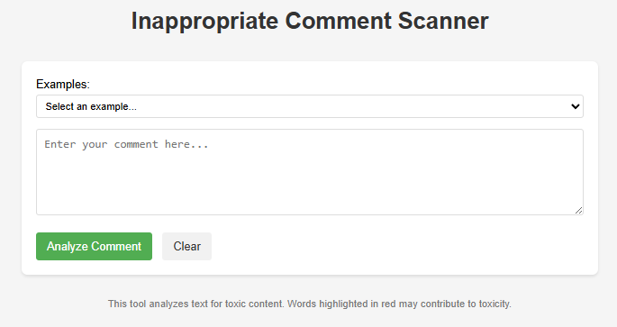
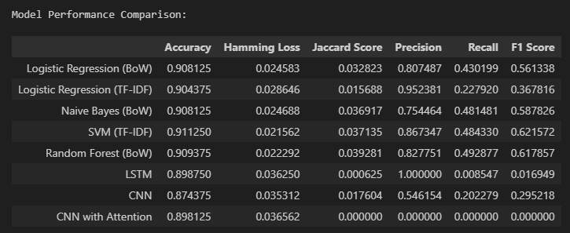
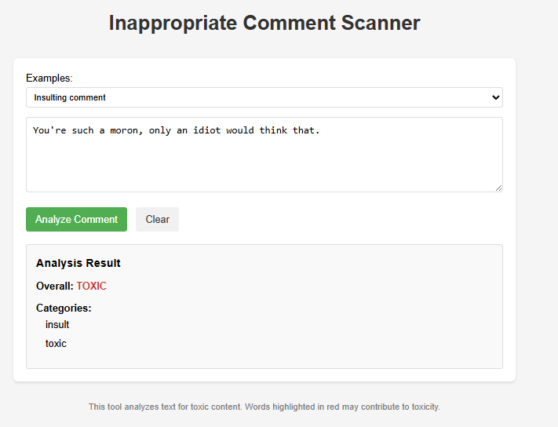
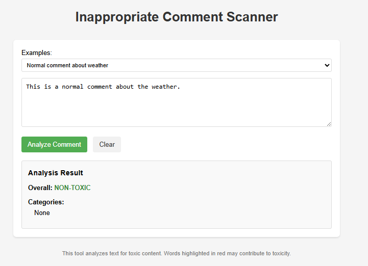

# Inappropriate Comment Scanner

A machine learning-based tool that detects and classifies toxic comments across six different categories: toxic, severe_toxic, obscene, threat, insult, and identity_hate.



## Overview

This project provides an end-to-end solution for detecting inappropriate content in text comments. It uses natural language processing and machine learning techniques to identify toxic language and classify it into specific categories.

The system can be used for:
- Content moderation in online platforms
- Filtering inappropriate comments in real-time
- Analyzing text for potential policy violations
- Educational purposes to demonstrate NLP and text classification

## Features

- **Multi-label Classification**: Detects six different types of toxic content simultaneously
- **User-Friendly Interface**: Simple web interface for easy testing and demonstration
- **Pre-built Examples**: Selection of sample texts to test different types of content
- **Real-time Analysis**: Immediate feedback on comment toxicity
- **Fallback Mechanism**: Uses keyword detection if the ML model encounters issues

## Model Performance

The system was trained on the Jigsaw Toxic Comment Classification dataset and evaluated on a validation set. Below are the performance metrics for various models:

| Model                      | Accuracy | Precision | Recall   | F1 Score |
|----------------------------|----------|-----------|----------|----------|
| SVM (TF-IDF)               | 0.9113   | 0.8673    | 0.4843   | 0.6216   |
| Random Forest (BoW)        | 0.9094   | 0.8278    | 0.4929   | 0.6179   |
| Naive Bayes (BoW)          | 0.9081   | 0.7545    | 0.4815   | 0.5878   |
| Logistic Regression (BoW)  | 0.9081   | 0.8075    | 0.4302   | 0.5613   |
| CNN                        | 0.8744   | 0.5462    | 0.2023   | 0.2952   |
| LSTM                       | 0.8988   | 1.0000    | 0.0085   | 0.0169   |

The SVM model with TF-IDF features provides the best balance of precision and recall, with an F1 score of 0.6216.



## Example Predictions

### Toxic Comment Example


### Non-Toxic Comment Example


## Technical Implementation

### Architecture

The system consists of three main components:
1. **Text Preprocessing**: Cleans and normalizes input text
2. **Feature Engineering**: Transforms text into numerical features using TF-IDF
3. **Classification Model**: Predicts toxicity categories using SVM

### Technologies Used

- **Python**: Core programming language
- **Flask**: Web framework for the user interface
- **scikit-learn**: Machine learning library for model training
- **NLTK**: Natural language processing tools
- **HTML/CSS/JavaScript**: Frontend interface

## Installation

### Prerequisites
- Python 3.8 or higher
- pip package manager

### Setup

1. Clone the repository:
```
git clone https://github.com/thakshana02/Inappropriate-Comment-Scanner.git
cd inappropriate-comment-scanner
```

2. Install required packages:
```
pip install flask numpy scikit-learn nltk
```

3. Run the application:
```
cd script
python app_fixed_enhanced.py
```

4. Open your browser and navigate to:
```
http://localhost:5000
```

## Project Structure

```
inappropriate-comment-scanner/
├── Dataset/                       # Dataset and saved models
│   ├── train.csv                  # Training data
│   ├── test.csv                   # Test data
│   └── saved model/               # Trained models
│       ├── svm_tfidf_model.pkl    # SVM model
│       ├── tfidf_vectorizer.pkl   # TF-IDF vectorizer
│       └── label_cols.pkl         # Label columns
├── script/                        # Application code
│   ├── app.py                     # Flask web application
│   └── app_fixed_enhanced.py      # Enhanced application
├── notebooks/                     # Jupyter notebooks
│   └── toxic_comment_classifier.ipynb  # Model training notebook
└── screenshots/                   # Screenshots for documentation
    ├── app_screenshot.png         # Main UI screenshot
    ├── model_performance.png      # Model comparison chart
    ├── toxic_example.png          # Example of toxic prediction
    └── nontoxic_example.png       # Example of non-toxic prediction
```

## Future Improvements

- **Multilingual Support**: Expand to detect toxicity in multiple languages
- **More Advanced Models**: Implement BERT or other transformer models for better accuracy
- **User Feedback Loop**: Allow users to provide feedback to improve the model
- **API Endpoint**: Create a standalone API for integration with other applications
- **Real-time Monitoring**: Add analytics dashboard for monitoring toxicity trends

## Acknowledgments

- The [Jigsaw Toxic Comment Classification Challenge](https://www.kaggle.com/c/jigsaw-toxic-comment-classification-challenge) for providing the dataset
- The open-source community for libraries and tools

## License

This project is licensed under the MIT License - see the LICENSE file for details.